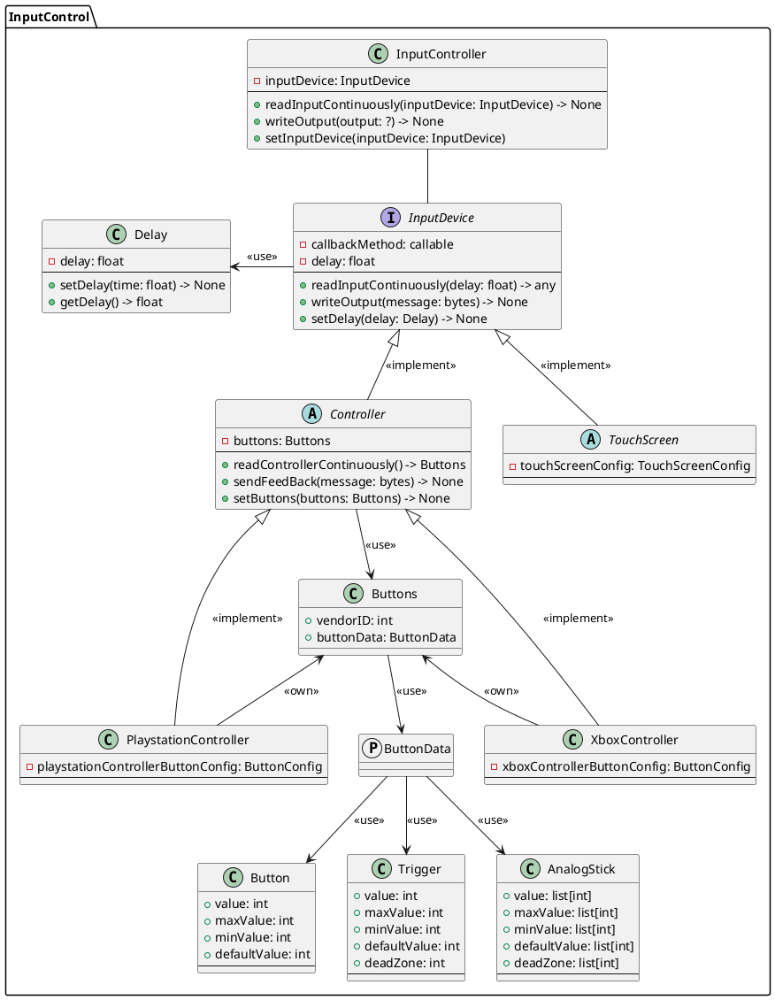

# Strategy-pattern with an additional abstraction-layer.

```plantuml
@startuml
package InputControl{
    interface InputDevice{
        -callbackMethod: callable
        -delay: float
        --
        +readInputContinuously(delay: float) -> any
        +writeOutput(message: bytes) -> None
        +setDelay(delay: Delay) -> None
    }
    
    class Delay{
        -delay: float
        --
        +setDelay(time: float) -> None
        +getDelay() -> float
    }
    
    class InputController{
        -inputDevice: InputDevice
        --
        +readInputContinuously(inputDevice: InputDevice) -> None
        +writeOutput(output: ?) -> None
        +setInputDevice(inputDevice: InputDevice)
    }
    
    abstract class TouchScreen{
        -touchScreenConfig: TouchScreenConfig
        --
    '    overrides readInputContinuously with readTouchScreenInput(touchScreen)
    }
    
    abstract class Controller{
        -buttons: Buttons
        --
    '    overrides readInputContinuously with readControllerInLoop(controller, callbackMethod: callable) 
        +readControllerContinuously() -> Buttons 
        +sendFeedBack(message: bytes) -> None
        +setButtons(buttons: Buttons) -> None
    }
    
    class XboxController{
        -xboxControllerButtonConfig: ButtonConfig
        --
    }
    
    class PlaystationController{
        -playstationControllerButtonConfig: ButtonConfig
        --
    }
    
    class Buttons{
        +vendorID: int 
        +buttonData: ButtonData   
    }
    
    protocol ButtonData{
    }
    
    class Button{
        + value: int
        + maxValue: int 
        + minValue: int 
        + defaultValue: int
        ---
    }
    
    class Trigger{
        + value: int 
        + maxValue: int 
        + minValue: int 
        + defaultValue: int
        + deadZone: int 
        ---
    }
    
    class AnalogStick{
        + value: list[int] 
        + maxValue: list[int] 
        + minValue: list[int]
        + defaultValue: list[int]
        + deadZone: list[int]
        ---
    }
    
    InputController -d- InputDevice
    InputDevice -l-> Delay: <<use>>
    TouchScreen -u-|> InputDevice: <<implement>>
    Controller -u-|> InputDevice: <<implement>>
    Controller --> Buttons: <<use>>
    XboxController -u-|> Controller: <<implement>>
    XboxController -u-> Buttons: <<own>>
    PlaystationController -u-|> Controller: <<implement>>
    PlaystationController -u-> Buttons: <<own>>
    Buttons --> ButtonData: <<use>>
    ButtonData -d-> Button: <<use>>
    ButtonData -d-> Trigger: <<use>>
    ButtonData -d-> AnalogStick: <<use>>
}
@enduml
```