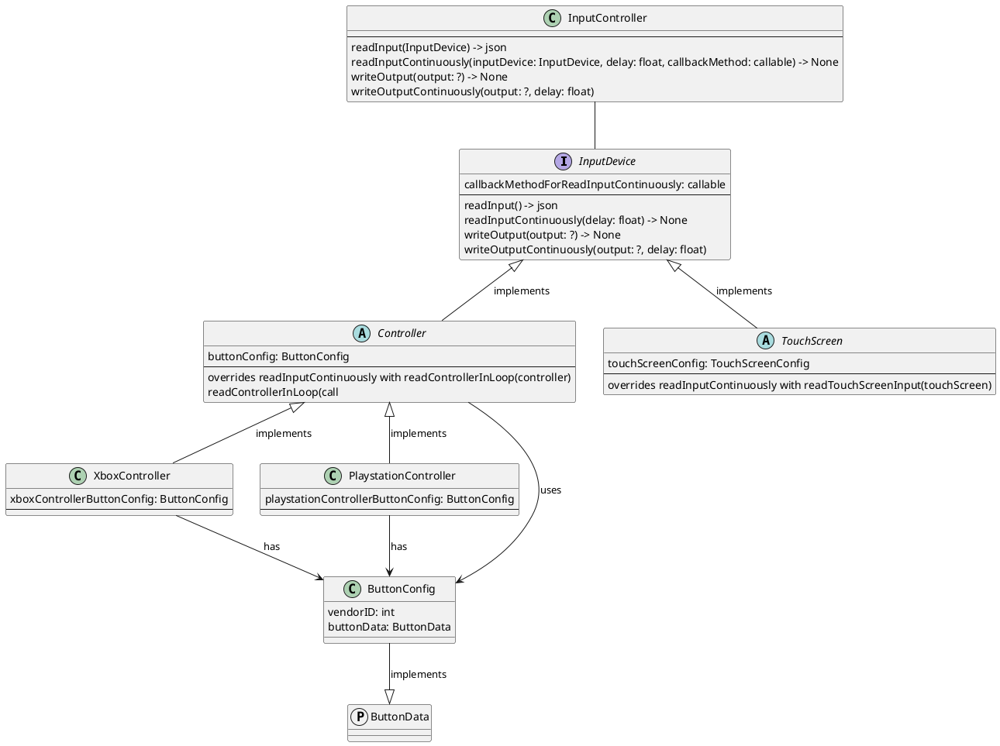

```plantuml
@startuml

interface InputDevice{
    callbackMethodForReadInputContinuously: callable
    --
    readInput() -> json
    readInputContinuously(delay: float) -> None
    writeOutput(output: ?) -> None
    writeOutputContinuously(output: ?, delay: float)
}

class InputController{
    --
    readInput(InputDevice) -> json
    readInputContinuously(inputDevice: InputDevice, delay: float, callbackMethod: callable) -> None
    writeOutput(output: ?) -> None
    writeOutputContinuously(output: ?, delay: float)
}

abstract class TouchScreen{
    touchScreenConfig: TouchScreenConfig
    --
    overrides readInputContinuously with readTouchScreenInput(touchScreen)
}

abstract class Controller{
    buttonConfig: ButtonConfig
    --
    overrides readInputContinuously with readControllerInLoop(controller) 
    readControllerInLoop(call
}

class XboxController{
    xboxControllerButtonConfig: ButtonConfig
    --
}

class PlaystationController{
    playstationControllerButtonConfig: ButtonConfig
    --
}

class ButtonConfig{
    vendorID: int 
    buttonData: ButtonData   
}

protocol ButtonData{
}

InputController -d- InputDevice
TouchScreen -u-|> InputDevice: implements
Controller -u-|> InputDevice: implements
Controller --> ButtonConfig: uses
XboxController -u-|> Controller: implements
XboxController --> ButtonConfig: has
PlaystationController -u-|> Controller: implements
PlaystationController --> ButtonConfig: has
ButtonConfig --|> ButtonData: implements
@enduml
```